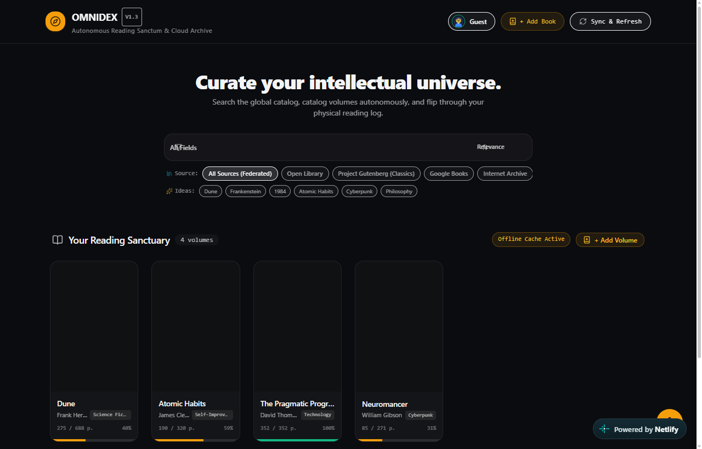
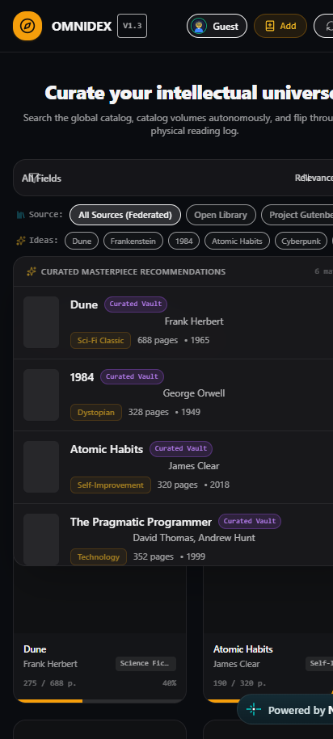

# Omnidex 🪐

> **The Personal Intellectual Universe & Autonomous Digital Bookshelf**  
> A local-first, privacy-respecting digital library system featuring unified multi-provider catalog discovery, 3D skeuomorphic page-flip reading logs, 36 handcrafted themes, 12 font families, and isolated multi-user profiles.

[](https://omnidex-digishelf.netlify.app/)
[](https://thunderbolt66-wav.github.io/omnidex/)
[](https://react.dev/)
[](https://vitejs.dev/)
[](https://tailwindcss.com/)
[](https://github.com/pmndrs/zustand)
[](LICENSE)

🚀 **Live Production (Netlify)**: [https://omnidex-digishelf.netlify.app/](https://omnidex-digishelf.netlify.app/)  
🪐 **Alternative Mirror (GitHub Pages)**: [https://thunderbolt66-wav.github.io/omnidex/](https://thunderbolt66-wav.github.io/omnidex/)

---

## 🖼️ Interface Preview

| Desktop Reading Sanctuary & OmniSearch | Mobile Curated Recommendations |
| :---: | :---: |
|  |  |

---

## 💡 What Omnidex Offers

**Omnidex** is an autonomous personal reading sanctum and intellectual catalog designed for readers, researchers, and book collectors who value **privacy, aesthetic typography, and zero-friction curation**.

Most modern reading apps require sign-ups, sell your reading telemetry, lock your notes into proprietary silos, or clutter your reading space with intrusive ads. Omnidex replaces that fragmented experience with a single, elegant, and 100% client-side bookshelf:

### 1. 🪐 Unified Global Discovery Without Accounts
Instead of jumping between multiple websites, Omnidex federates search queries simultaneously across **Project Gutenberg**, **Open Library**, **Internet Archive**, and **Google Books** alongside a curated offline vault. Search by book title, author, or subject and add volumes to your permanent shelf with one click.

### 2. 📖 Realistic 3D Skeuomorphic Reading Log
Reading isn't just about text on a flat screen. Omnidex brings the tactile warmth of physical books to the browser:
- **GPU-Accelerated 3D Page Turns**: Flip through your reading log with realistic paper physics, page sheen, and spine shadow simulation.
- **Reading Progress & Bookmark Tracking**: Keep track of current pages read, dynamic percentage completions, and volume statuses.
- **Dedicated Volume Notes Journal**: Jot down memorable passages, thoughts, questions, and chapter insights tied directly to each book.
- **Flat Mode Fallback**: Full support for users who prefer standard flat modals via the *Reduce Motion* toggle.

### 3. 👥 True Multi-Profile Isolation on One Device
Share your computer or organize different reading domains (Fiction, Academic, Work, Personal) without data bleeding:
- **Zero Cloud Account Dependency**: Profiles exist purely on your local device.
- **Strict Partitioning**: Bookshelves, search histories, themes, and font preferences in one profile remain completely invisible to other profiles.
- **Default Guest Profile**: Starts cleanly with a single prebuilt `Guest` profile on initial visit.
- **20+ Expressive Avatars & Custom Uploads**: Personalize profiles with custom artwork or choose from over 20 tailored SVG avatar personas.
- **PIN-Lock Privacy**: Protect personal or private reading shelves with local SHA-256 4-digit PIN verification.
- **1-Click Portability**: Export your entire digital universe to a single encrypted JSON file and import it anywhere instantly.

### 4. 🎨 36 Handcrafted Color Themes & 12 Curated Fonts
Your reading sanctuary should match your ambient environment and mood:
- **8 Tactile Paper Textures**: Authentic reading simulations calibrated for *Parchment, Newsprint, Cream Book, Kraft Paper, Blueprint Grid, Legal Pad, Washi, and Cotton Rag*.
- **OLED, Dark & Cyberpunk Palettes**: Low-light reading with *Midnight Obsidian, Tokyo Night, Dracula, Gruvbox, Nord, Monokai, OLED Pure Black, Solarized Dark, and Espresso Warmth*.
- **12 Curated Typographic Families**: Seamless switching between timeless serif types (*Cinzel, Playfair Display, Merriweather, Lora, EB Garamond, Cormorant*), modern sans-serifs (*Outfit, Inter, Plus Jakarta Sans*), and monospaced terminal fonts (*Fira Code, Space Grotesk*).
- **Custom Slim Scrollbars**: Eliminates clumsy browser-default scrollbars that break page aesthetics and waste screen space.

### 5. 🖌️ Algorithmic Typographic Cover Generation
Never endure broken or missing cover art. When creating a custom volume or cataloging rare texts, Omnidex automatically generates a bespoke, publication-grade cover on HTML5 Canvas using classical typography layouts and harmonious color palettes.

### 6. 🔒 100% Privacy & Data Sovereignty
- **No Trackers, No Analytics, No Cookies**: Your reading habits belong strictly to you.
- **Works Offline**: The entire catalog engine, shelf management, and flipbook reader work completely offline without an active internet connection.
- **Optional Cloud Backup**: Built-in optional [Supabase](https://supabase.com/) sync if you choose to synchronize across your personal devices.

---

## 🌟 Key Highlights

### 🪐 Unified OmniSearch
- **Global Catalog Aggregation**: Query seamlessly across **Project Gutenberg**, **Open Library**, **Internet Archive**, **Google Books**, and an offline **Curated Vault**.
- **Field-Level Query Targeting**: Instant filtering by *Title*, *Author*, or *Topic/Genre*.
- **Live Debounce & Smart Caching**: Ultra-responsive search input with zero visual clutter, real-time keyboard navigation (`↑`/`↓`/`Enter`/`Esc`), and clearable search history.

### 📖 Skeuomorphic 3D PageFlip Reader
- **Realistic 3D Book Physics**: Experience turning pages with realistic book physics powered by `react-pageflip` and GPU-accelerated transforms.
- **Reading Progress Tracking**: Dynamic page slider, percentage calculations, and completion status.
- **Interactive Reading Journal**: Dedicated notes page with instant local saving for quotes, reflections, and chapter insights.
- **Accessible Flat Mode**: Smooth fallback to a clean, static reader modal for reduced motion preferences.

### 👥 Local-First Multi-Profile Architecture
- **Complete Privacy & Local Isolation**: All profiles, bookshelves, notes, and search logs are stored 100% locally on your machine (`localStorage`). No forced logins or third-party accounts.
- **Default Guest Profile**: Starts cleanly with a prebuilt `Guest` profile on initial launch.
- **20+ Expressive Avatars & Custom Uploads**: Choose from over 20 tailored SVG avatar personas or paste/upload custom image avatars.
- **PIN Lock Protection**: Secure sensitive profiles with local SHA-256 4-digit PIN verification.
- **Multi-Profile Portability**: One-click **Export / Import** to backup and transfer all profiles and libraries via encrypted JSON files.

### 🎨 36 Handcrafted Themes & 12 Typography Families
- **Paper & Tactile Textures**: *Parchment, Newsprint, Cream Book, Kraft Paper, Blueprint Grid, Legal Pad, Washi, and Cotton Rag*.
- **Dark, OLED & Cyberpunk Modes**: *Midnight Obsidian, Cyberpunk Neon, Tokyo Night, Dracula, Gruvbox, Nord, Monokai, OLED Pure Black, Solarized Dark, and Espresso Warmth*.
- **12 Curated Font Families**: Tailor your reading experience with *Cinzel, Playfair Display, Merriweather, Lora, EB Garamond, Cormorant, Space Grotesk, Fira Code, Outfit, Inter, Plus Jakarta Sans, and Crimson Pro*.

### 🎨 Procedural Canvas Book Cover Engine
- Manually added or imported books without cover art automatically receive an algorithmically generated, typographic cover designed in HTML5 Canvas with custom color palettes and classic publisher styles.

---

## 🏗️ Architecture & Tech Stack

| Layer | Technologies |
| :--- | :--- |
| **Frontend Framework** | [React 19](https://react.dev/) + [Vite 8](https://vitejs.dev/) |
| **Styling & UI** | [Tailwind CSS 3.4](https://tailwindcss.com/) + CSS Grid + Custom Scrollbar Elimination |
| **State Management** | [Zustand 5](https://github.com/pmndrs/zustand) (Modular stores for Settings & Profiles) |
| **Icons & Visuals** | [Lucide React](https://lucide.dev/) |
| **Animation & 3D** | `react-pageflip` + [Framer Motion](https://www.framer.com/motion/) |
| **Storage Architecture** | Redundant Multi-Key LocalStorage + Optional [Supabase](https://supabase.com/) Cloud Synchronization |

---

## 🚀 Quick Start

### Prerequisites
- [Node.js](https://nodejs.org/) (v18 or higher recommended)
- `npm`, `pnpm`, or `yarn`

### Installation

1. **Clone the repository**:
   ```bash
   git clone https://github.com/YOUR_USERNAME/omnidex.git
   cd omnidex
   ```

2. **Install dependencies**:
   ```bash
   npm install
   ```

3. **(Optional) Configure Supabase Cloud Sync**:
   Omnidex works 100% locally by default. If you want optional multi-device cloud backup:
   ```bash
   cp .env.example .env
   ```
   Add your Supabase project credentials in `.env`:
   ```env
   VITE_SUPABASE_URL=https://your-project.supabase.co
   VITE_SUPABASE_ANON_KEY=your-anon-key
   ```

4. **Start the local development server**:
   ```bash
   npm run dev
   ```
   Open [http://localhost:5173](http://localhost:5173) in your browser.

5. **Build for production**:
   ```bash
   npm run build
   ```

---

## 📂 Project Structure

```text
omnidex/
├── public/                 # Static assets & favicon
├── src/
│   ├── components/         # Reusable UI components
│   │   ├── InteractiveBookModal.jsx  # 3D FlipBook & Flat Reader modal
│   │   ├── LibraryGrid.jsx           # Bookshelf grid & volume cards
│   │   ├── ManualBookModal.jsx       # Volume creation & canvas cover generator
│   │   ├── OmniSearch.jsx            # Multi-engine search bar & dropdown
│   │   ├── ProfileModal.jsx          # Profile switcher, PIN & backup modal
│   │   ├── SearchHistoryModal.jsx    # Privacy search logs manager
│   │   └── SettingsPanel.jsx         # Customization drawer (36 themes & 12 fonts)
│   ├── lib/                # Services, utilities & data layers
│   │   ├── bookSyncService.js        # Local cache + Supabase sync engine
│   │   ├── profileService.js         # Multi-profile isolation & JSON backup
│   │   ├── profileAvatars.js         # 20+ SVG Avatar definitions
│   │   ├── searchHistoryService.js   # Scoped search history manager
│   │   ├── securityUtils.js          # Input sanitation & safe image validation
│   │   ├── supabase.js               # Supabase client connector
│   │   └── themeStyles.js            # 36 theme color mappings
│   ├── store/              # Zustand global state
│   │   └── useSettingsStore.js       # Active profile settings store
│   ├── App.jsx             # Main dashboard & navbar layout
│   ├── index.css           # Global typography, custom scrollbars, and resets
│   └── main.jsx            # Application entry point
├── .env.example            # Environment configuration template
├── package.json            # Scripts & project dependencies
└── vite.config.js          # Vite build configuration
```

---

## 🛡️ Privacy & Security

- **Zero Third-Party Trackers**: No analytics, telemetry, or external trackers injected.
- **Safe Image Content Security**: External book covers pass through a strict URL sanitizer (`securityUtils.js`) defending against injection attacks.
- **Isolated Profile Sandboxes**: Each user profile's bookshelf, notes, and search queries reside in uniquely scoped local storage partitions.

---

## 📄 License

This project is licensed under the [MIT License](LICENSE) — feel free to explore, fork, and build upon it!
